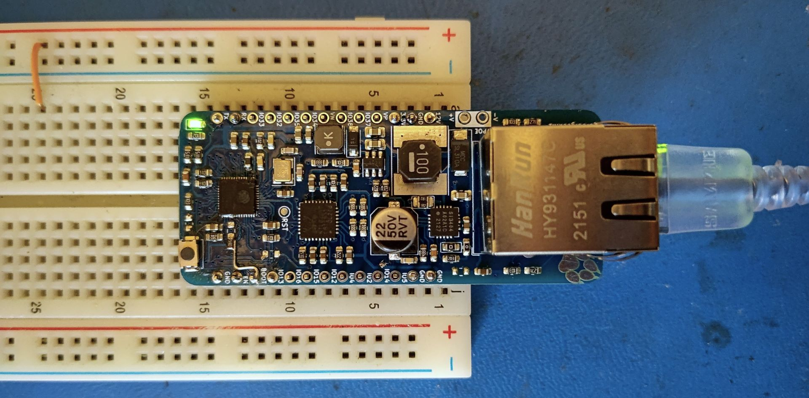

## ESP32 PoE Dev Board

A simple ESP32 ethernet + PoE dev board



WARNING: PoE is NOT ISOLATED! Be careful what you attach.

See [jared.geek.nz/esp32-poe-devboard](jared.geek.nz/esp32-poe-devboard) for the story.

## Usage

### ESPHome

```yaml
esp32:
  board: esp32dev

ethernet:
  type:     RTL8201
  mdc_pin:  GPIO23
  mdio_pin: GPIO18
  clk_mode: GPIO0_OUT
  phy_addr: 0

...
```

### Arduino

`main.cpp`
```cpp
void setup() {
    // WiFi antenna not available on this board
    WiFi.mode(WIFI_OFF); 

    ETH.begin();
    ETH.config();
}
```

`platformio.ini`
```ini
[platformio]

[env:esp32_poe]
platform  = espressif32
framework = arduino
board     = esp32_dev
build_flags = 
    -DETH_PHY_ADDR=0
    -DETH_PHY_MDC=23
    -DETH_PHY_MDIO=18
    -DETH_PHY_TYPE=ETH_PHY_RTL8201
    -DETH_CLK_MODE=ETH_CLOCK_GPIO0_OUT

```

